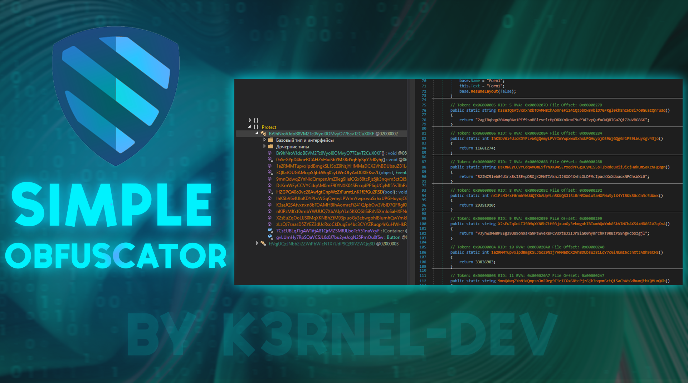

# 🛡️ Simple Obfuscator Module



## 🅰️ Description

**Simple Obfuscator Module** — a library designed for easy obfuscation of .NET code. It provides a simple and effective way to mutate the original application names, making it harder to read

## 💻 Obfuscate-Review:
<p float="left">
  
</p> 

### 🖥️ Example Usage
 * The first add link to .dll file in VS** on your project
 * Secondly after add link, you can use this example code:
```csharp
    private void ButtonEample_click(object sender, EventArgs e)
        {
            using (OpenFileDialog openFileDialog = new OpenFileDialog())
            {
                if (openFileDialog.ShowDialog() == DialogResult.OK)
                {
                    using (SaveFileDialog saveFileDialog = new SaveFileDialog())
                    {
                        if (saveFileDialog.ShowDialog() == DialogResult.OK)
                        {
                            try
                            {
                                byte[] fileData = System.IO.File.ReadAllBytes(openFileDialog.FileName);
                                SimpleObfuscator.Obfuscator.Save(fileData, saveFileDialog.FileName);
                            }
                            catch (Exception ex)
                            {
                                MessageBox.Show($"Error: {ex.Message}");
                            }
                        }
                    }
                }
            }
        }
```
## ✨ Requirements
`You need a dnlib for compiling this project and 4.0 framework ⚠️ `

### > **[Download compiled-version]()**
